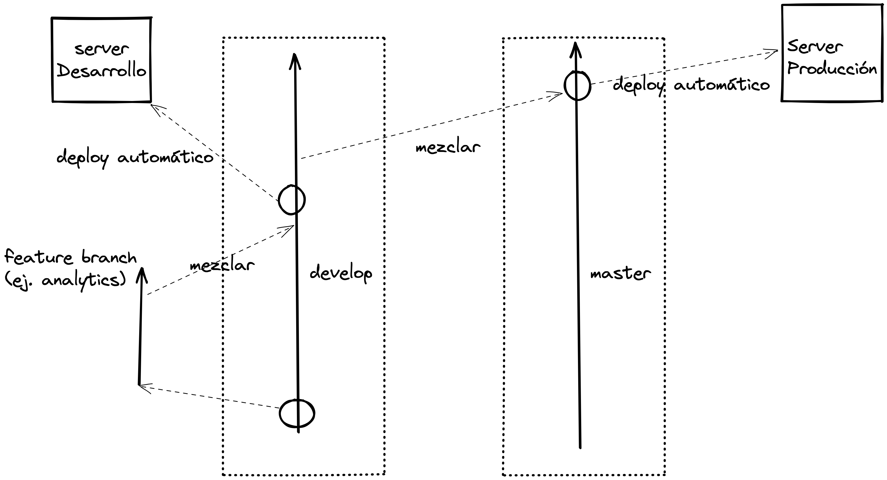

## Flujo de trabajo con Git/Github para desarrollo y pase a producción

Esquema de ejemplo:

# 1) Fase desarrollo

1. Se crea rama de feature a partir de `develop`. Ejemplo: para desarrollar feature de analytics.
2. Cuando el feature está listo se mezcla a `develop` por medio de un PR
3. Esta mezcla a develop dispara un deploy automático con [Github Actions](../.github/workflows/deploy-dev.yml) al [servidor de desarrollo](http://fischwarm-frontend-dev.s3-website-sa-east-1.amazonaws.com).
4. Más ramas de feature se van mezclando a develop. Ejemplo; filtro por rubros.
5. Cuando se hayan testeado todos los últimos features en desarrollo se inicia el pase a producción (siguiente sección)

# 2) Fase paso a producción

1. Se mezcla el contenido actual de develop a la rama `master`, por medio de un PR. Ejemplo: develop conteniendo anaylticis y filtro por rubros se mezcla a master.
2. Al hacer la mezcla a master se dispara automáticamente un deploy con [Github Actions](../.github/workflows/deploy.yml) al [servidor de producción](http://form.asepy.org).
3. Los últimos features implementados sobre develop (ej.: anaylticis, filtro rubros) ya están en master y listos para ser utilizados en producción.

# Observaciones 🔍

1. Si hay features que dependen de cambios en el [backend](https://github.com/Asepy/fischwarm-backend), ejemplo; soporte filtro rubros. Se debe realizar primero el pase a producción del backend antes de realizar los pasos descritos en la sección 2) de este documento.
2. El pase a producción del backend puede tener su propio flujo de ramas y deploy, distinto en independiente al mencionado en este documento.

# Lectura adicional

1. [Artículo de Atlassian sobre Git Workflow](https://www.atlassian.com/git/tutorials/comparing-workflows/gitflow-workflow)
2. [Otro artículo sobre Git Workflow](https://nvie.com/posts/a-successful-git-branching-model/)
